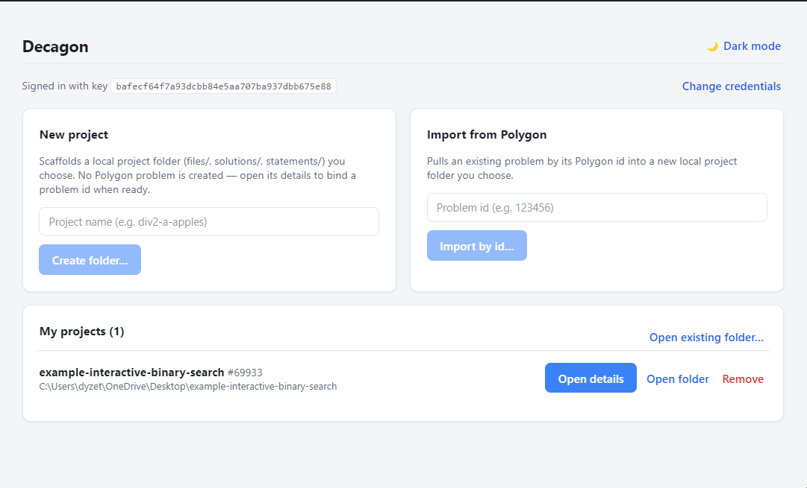

# Decagon

**Manage your Codeforces [Polygon](https://polygon.codeforces.com) problems from a desktop app — no web UI.**

Decagon lets you edit problem statements, tests, solutions, files and scoring, build
packages, and commit revisions — all backed by local folders you control. Each problem is
one folder bound to one Polygon problem.

> Independent project, not affiliated with Codeforces. Pushing the final package into a
> round still happens on the Codeforces website.

## Screenshots

<table>
  <tr>
    <td width="50%"> <b>Info</b> — limits, checker/validator, points mode</td>
    <td width="50%"> <b>Statements</b> — per-language fields & resources</td>
  </tr>
  <tr>
    <td> <b>Files</b> — source / resource split + grader properties</td>
    <td> <b>Tests</b> — groups, points & generation scripts</td>
  </tr>
</table>

## Get started

1. **Install** — download the installer from the [Releases](../../releases) page, or run
   from source: `npm install` then `npm run dev`.
2. **Add your API key** — in Polygon, go to *Settings → API keys* and create one. Enter
   the key and secret in Decagon (stored encrypted on your device; it never leaves your
   machine).
3. **Create or import a problem:**
   - **New project** — scaffolds a local folder. Open it and either bind an existing
     Polygon problem id, or create a brand-new problem on Polygon (with any name).
   - **Import from Polygon** — pulls an existing problem by its id into a new folder.

## How saving works

This is the core idea, so it's worth 20 seconds:

- **Save** writes to your **local folder** only. Every file and section has its own Save
  button, enabled only when you have unsaved changes.
- **Push to Polygon** uploads your **saved** folder to Polygon. (Unsaved edits aren't
  pushed — Decagon warns you.)
- **Pull** downloads the current state from Polygon into the folder.
- If a file changed **outside the app** since you opened it, Decagon asks whether to keep
  your in-app version or load the version from disk.

> One exception: **saving a generation script also pushes it** to Polygon, since scripts
> must be on Polygon to generate tests.

## What each tab does

| Tab | What you do there |
| --- | --- |
| **Info** | Time/memory limits, input/output files, interactive flag, checker/validator/interactor, and points mode (off / on / treat checker points as %). |
| **Statements** | Edit each field (legend, input, output, scoring, notes, …) per language, plus shared resources (images, `.sty`). |
| **Solutions** | Add solution files and set each one's tag (main, correct, wrong answer, TLE, …). |
| **Files** | **Source files** (generators, validators, checkers — use `testlib.h`) and **Resource files** (headers, `.sty`). Resource files support experimental **grader advanced properties** (stages / assets / `cpp.*` `python.*`). |
| **Tests** | Manual and script-generated tests per testset, the generation script, scoring **groups** (points/feedback policy, dependencies), and points per test. Bulk-edit groups/points across many tests. |
| **Validator tests** | Feed an input to the validator and assert it's accepted or rejected. |
| **Checker tests** | Feed input/output/answer and assert the checker's verdict. |
| **Packages** | Build a package (`full` / `verify`), see its status, and download the ZIP. |
| **Commit** | Save a revision of your working copy on Polygon. |
| **Manage access** | View your access level (read-only — change collaborators on the Polygon site). |

## A typical session

1. **Pull** (or Import) to get the latest problem state.
2. Edit a statement / solution / test, and **Save** that item.
3. **Push to Polygon** when you're happy with the saved changes.
4. **Build** a package in the Packages tab and **download** it.
5. **Commit** to save a revision.
6. Upload the package into your round on the Codeforces website (manual step).

## Good to know

- Removing a **test** locally and pushing deletes it on Polygon. Other items
  (files, solutions, statements, resources, validator/checker tests) have no delete API —
  remove those on the Polygon website.
- **Testsets** can't be created here (no API) — make them on the Polygon site, then Pull.
- **Binary files** (e.g. statement images) are pulled but not pushed back.
- **Stress testing** and **access management** have no API, so they aren't editable here.

## License

[MIT](LICENSE)
