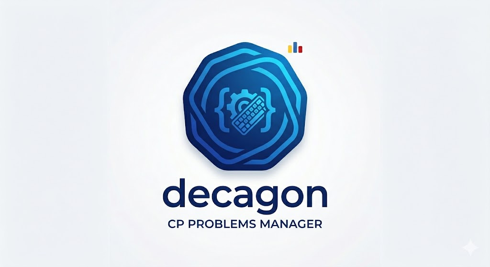
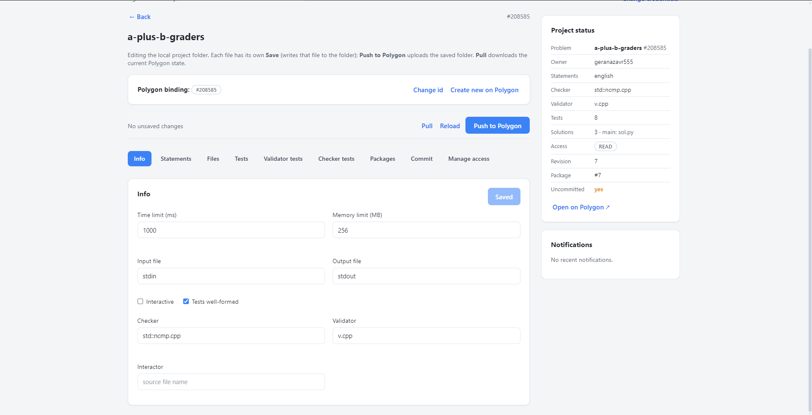
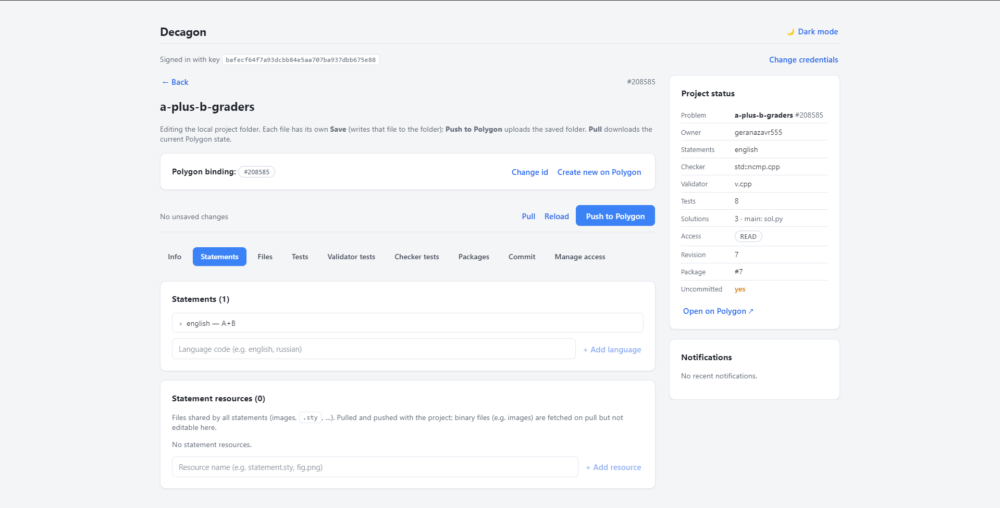
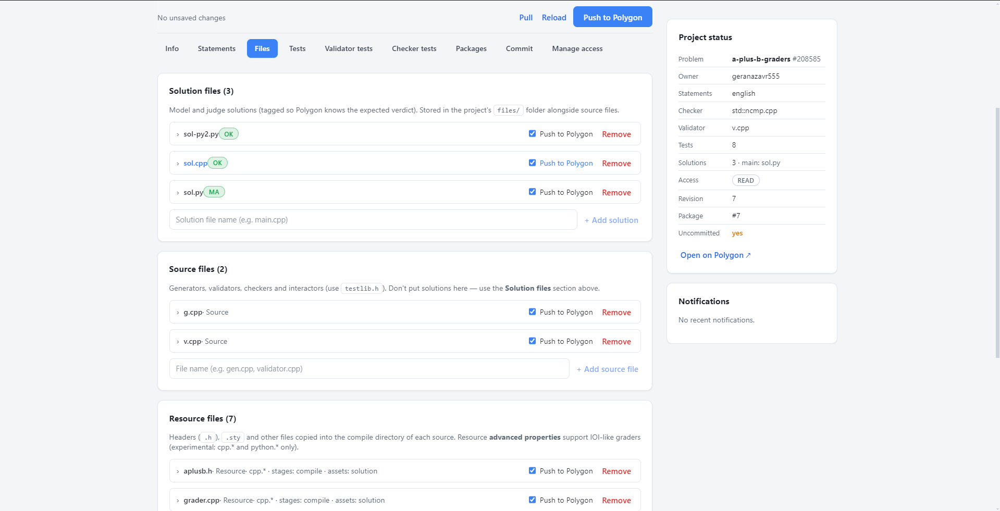
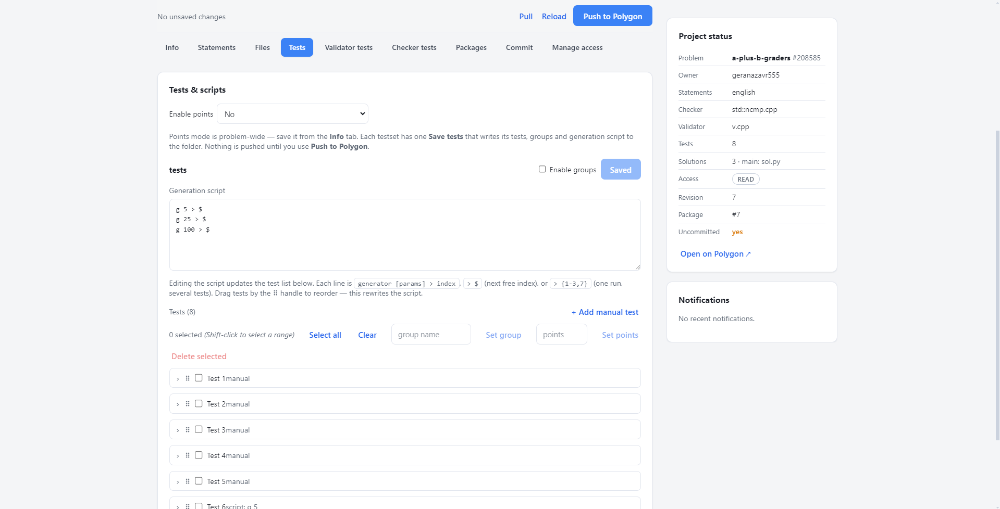

<div align="center">



**Manage your Codeforces [Polygon](https://polygon.codeforces.com) problems from a desktop app — no web UI.**

[](LICENSE)

</div>

Decagon lets you edit problem statements, tests, solutions, files and scoring, build
packages, and commit revisions — all backed by local folders you control. Each problem is
one folder bound to one Polygon problem.

> Independent project, not affiliated with Codeforces. Pushing the final package into a
> round still happens on the Codeforces website.

## Screenshots

<table>
  <tr>
    <td width="50%"><br><sub><b>Info</b> — limits, checker/validator, points mode</sub></td>
    <td width="50%"><br><sub><b>Statements</b> — per-language fields & resources</sub></td>
  </tr>
  <tr>
    <td><br><sub><b>Files</b> — solutions, source, resources & attachments</sub></td>
    <td><br><sub><b>Tests</b> — groups, points & generation scripts</sub></td>
  </tr>
</table>

## Get started

1. **Install** — download the installer from the [Releases](../../releases) page, or run
   from source: `npm install` then `npm run dev`.
2. **Add your API key** — in Polygon, go to *Settings → API keys* and create one. Enter
   the key and secret in Decagon (stored encrypted on your device; it never leaves your
   machine).
3. **Create or import a problem:**
   - **New project** — scaffolds a local folder. Open it and either bind an existing
     Polygon problem id, or create a brand-new problem on Polygon (with any name).
   - **Import from Polygon** — pulls an existing problem by its id into a new folder.

## How saving works

This is the core idea, so it's worth 20 seconds:

- **Save** writes to your **local folder** only. Each file and section has its own Save
  button, enabled only when you have unsaved changes. (In the **Tests** tab a single
  *Save tests* button writes that testset's tests, scoring groups and generation script
  together — still local only.)
- **Push to Polygon** uploads your **saved** folder to Polygon. Nothing reaches Polygon
  until you push; unsaved edits aren't pushed, and Decagon warns you. A progress bar shows
  what's uploading, and re-pushing is **incremental** — only the tests that actually
  changed are re-uploaded.
- **Pull** downloads the current state from Polygon into the folder. Files you keep locally
  that don't exist on Polygon are preserved (not deleted).
- The folder is **watched**: if it changes on disk, Decagon reloads automatically. If a
  file you're editing changed **outside the app**, it asks whether to keep your in-app
  version or load the version from disk.

## What each tab does

| Tab | What you do there |
| --- | --- |
| **Info** | Time/memory limits, input/output files, interactive flag, checker/validator/interactor, and points mode (off / on / treat checker points as %). Clearing a checker or validator and pushing unsets it on Polygon. |
| **Statements** | Edit each field (legend, input, output, scoring, notes, …) per language, plus shared resources (images, `.sty`). |
| **Files** | One place for every file, in four sections: **Solution files** (each with a tag — main, correct, wrong answer, TLE, …), **Source files** (generators, validators, checkers — use `testlib.h`), **Resource files** (headers, `.sty`), and **Attachments**. A unit's Type dropdown moves it between sections, and a per-file checkbox controls whether it's pushed. Resource files support experimental **grader advanced properties** (stages / assets / `cpp.*` `python.*`). |
| **Tests** | Manual and script-generated tests per testset, scoring **groups** (points/feedback policy, dependencies), and points per test. The **generation script** and the test list stay in sync: editing the script updates which tests exist, and **drag-and-drop reordering** of tests rewrites the script to match. Bulk-edit groups/points across many tests. |
| **Validator tests** | Feed an input to the validator and assert it's accepted or rejected. |
| **Checker tests** | Feed input/output/answer and assert the checker's verdict. |
| **Packages** | Build a package (`full` / `verify`), see its status, and download the ZIP. |
| **Commit** | Save a revision of your working copy on Polygon. |
| **Manage access** | View your access level (read-only — change collaborators on the Polygon site). |

A **sidebar** on the right stays visible across tabs: a **Project status** card summarizes
the problem at a glance (statements, checker/validator, test & solution counts, owner,
access, revision, latest package, uncommitted changes) and a **Notifications** panel keeps
a log of recent actions so toasts that auto-dismissed aren't lost.

## Writing generation scripts

Decagon uses Polygon's script format. Each line runs a generator and writes one or more
tests:

```
gen 1 5 > 3        # write a test at index 3
gen 1 5 > $        # write to the next free index
gen2 4 7 > {1-3,7} # one run that produces several tests (indices 1,2,3,7)
```

Edit the script and the test list updates; reorder tests by their drag handle and the
script's target indices update to match. Generators are produced by Polygon on build, so
generated tests show their command as a placeholder until you build a package.

## A typical session

1. **Pull** (or Import) to get the latest problem state.
2. Edit a statement / solution / test, and **Save** that item.
3. **Push to Polygon** when you're happy with the saved changes.
4. **Build** a package in the Packages tab and **download** it.
5. **Commit** to save a revision.
6. Upload the package into your round on the Codeforces website (manual step).

## Good to know

- Removing a **test** locally and pushing deletes it on Polygon. Other items
  (files, solutions, statements, resources) have no delete API — remove those on the
  Polygon website. Validator/checker tests can only be added or edited here, not deleted.
- **Local-only files** kept in your folder but not on Polygon survive a Pull.
- **Testsets** can't be created here (no API) — make them on the Polygon site, then Pull.
- **Binary files** (e.g. statement images) are pulled but not pushed back.
- **Stress testing** and **access management** have no API, so they aren't editable here.

## Built with

Electron · React · TypeScript · [electron-vite](https://electron-vite.org).

## License

[MIT](LICENSE)
